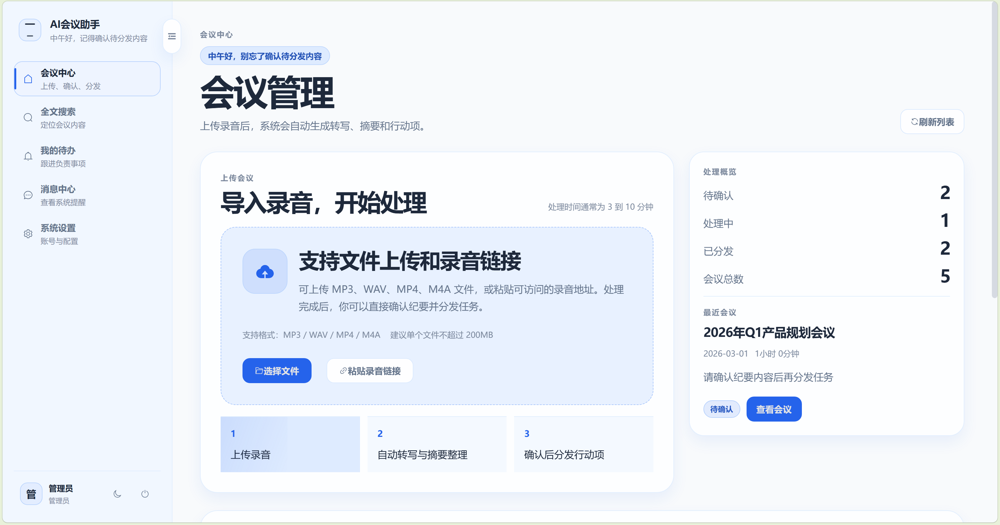
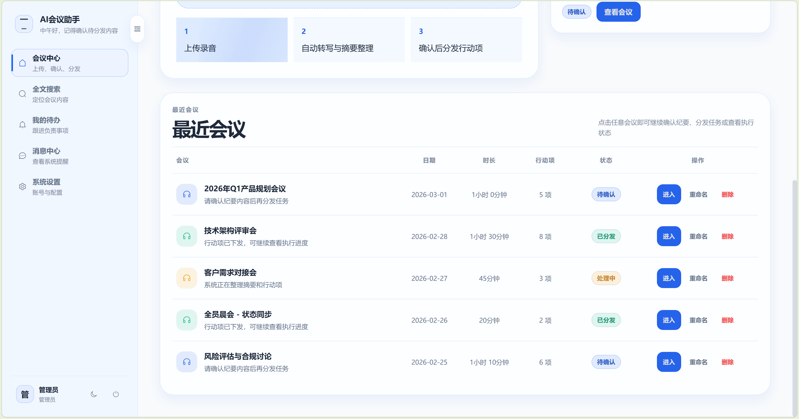
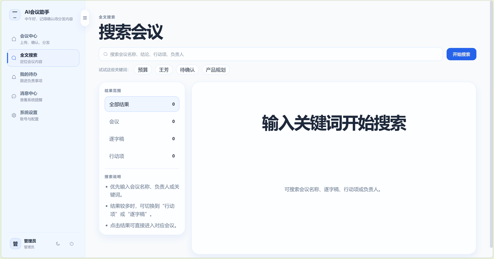
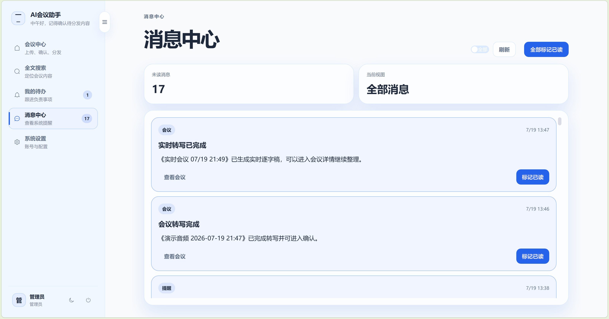
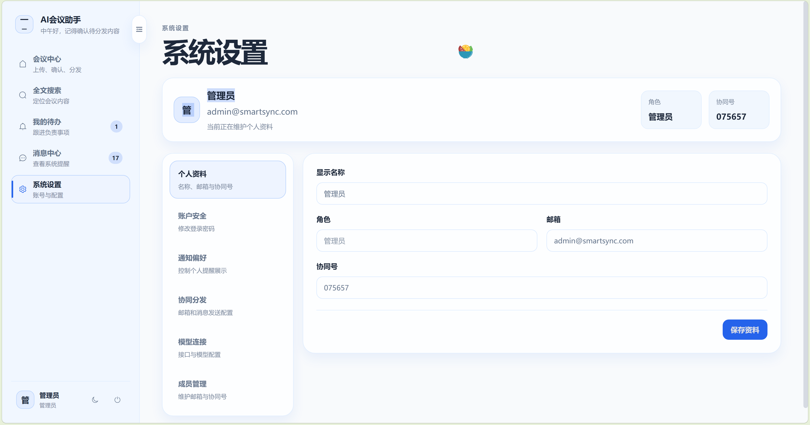
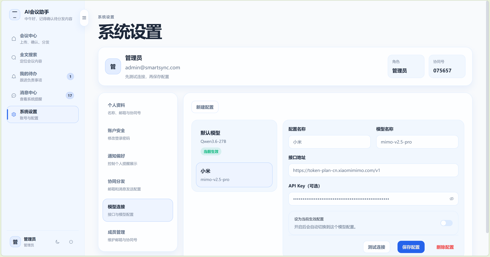

# SmartSync

SmartSync 是一个会议转写与协作系统，包含录音上传、实时记录、逐字稿、AI 摘要、行动项和邮件分发。

## 界面预览

### 首页

| 首页概览 | 首页详情 |
| --- | --- |
|  |  |

### 全文搜索



### 我的待办


### 消息中心



### 系统设置

| 基础设置 | 服务配置 |
| --- | --- |
|  |  |

## 本地启动

需要 Python 3.11+、Node.js 20+ 和 MySQL 8.0。

### 1. 配置后端

```powershell
Copy-Item .env.example backend/.env
notepad backend/.env
```

至少填写 `MYSQL_HOST`、`MYSQL_USER`、`MYSQL_PASSWORD`、`MYSQL_DB` 和 `SECRET_KEY`。转写、LLM、邮件功能按需再填写对应配置。

安装后端依赖：

```powershell
Set-Location backend
python -m pip install -r requirements.txt
Set-Location ..
```

初始化空数据库：

```powershell
mysql -u root -p -e "CREATE DATABASE IF NOT EXISTS smartsync CHARACTER SET utf8mb4;"
mysql -u root -p smartsync -e "source backend/基础表.sql"
```

首次创建管理员：

```powershell
$env:ADMIN_USERNAME = "admin"
$env:ADMIN_PASSWORD = Read-Host "管理员密码"
$env:ADMIN_NAME = "管理员"
Set-Location backend
python -m scripts.bootstrap_admin
Set-Location ..
```

管理员密码至少 8 个字符，项目不提供固定默认密码。

### 2. 启动后端

```powershell
Set-Location backend
python -m uvicorn app.main:app --reload --port 8000
```

健康检查：<http://127.0.0.1:8000/health>

### 3. 启动前端

新开一个终端：

```powershell
Set-Location frontend
npm install
npm run dev
```

浏览器访问终端输出的地址，默认是 <http://127.0.0.1:3333>。

## Docker 部署

服务器部署使用 `docker-compose.yml` 和 `.env.server.example`：

```bash
cp .env.server.example .env
# 填写 MYSQL_PASSWORD、MYSQL_ROOT_PASSWORD、ADMIN_PASSWORD、SECRET_KEY
docker compose up -d --build
curl -fsS http://127.0.0.1:9090/api/health
```

完整的 HTTPS、备份和故障处理说明见 [Docker部署说明.md](Docker部署说明.md)。

## 参与贡献

欢迎通过 Issue 提交问题或建议，也欢迎通过 Pull Request 改进 SmartSync。开始贡献前，请阅读 [贡献指南](CONTRIBUTING.md)，其中包含开发流程、测试要求和提交规范。

## 安全

如果你发现安全漏洞，请不要在公开 Issue 中披露漏洞细节。请按照 [安全说明](SECURITY.md) 使用 GitHub 的私有漏洞报告渠道联系维护者。

## 许可证

本项目基于 [MIT License](LICENSE) 开源。

